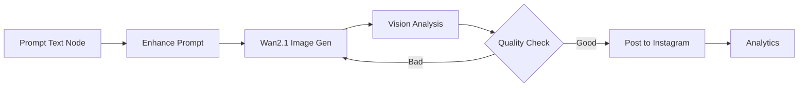

# VlowGen Platform - Project Overview

## 📋 Table of Contents
1. [Problem Statement](#problem-statement)
2. [Solution](#solution)
3. [Tech Stack](#tech-stack)
4. [How It Works](#how-it-works)
5. [Unique Selling Points (USP)](#unique-selling-points-usp)
6. [Milestones & Roadmap](#milestones--roadmap)

---

## 🎯 Problem Statement

### The Challenge
Content creators dan digital marketers menghadapi tantangan besar dalam era digital:

#### 1. **Workflow yang Kaku dan Terfragmentasi**
- Harus menggunakan 5-10 tools berbeda untuk satu konten
- ChatGPT untuk ide → Midjourney untuk gambar → Canva untuk edit → Hootsuite untuk schedule
- Tidak ada cara untuk membuat logika custom (if/else, loops, conditions)
- Proses manual yang memakan waktu 2-3 jam per konten

#### 2. **Platform Fatigue**
- Setiap platform sosial media punya requirement berbeda
- Instagram: Square 1:1, TikTok: Vertical 9:16, YouTube: Horizontal 16:9
- Harus manual adjust dan re-upload untuk setiap platform
- Kehilangan momentum viral karena delay posting

#### 3. **Lack of Automation**
- Tidak ada platform yang menyatukan AI generation + distribution + analytics
- Existing tools (Hootsuite, Buffer) hanya untuk scheduling, bukan generation
- AI tools (ChatGPT, Midjourney) tidak terintegrasi dengan social media
- Butuh technical skills untuk membuat automation sendiri

#### 4. **Monetization Friction**
- Sulit memonetisasi konten digital
- NFT minting terpisah dari content creation workflow
- Tidak ada cara otomatis untuk convert viral content → digital asset

### Real-World Impact
- **Time Lost:** Content creators spend 60-70% waktu untuk manual tasks
- **Opportunity Cost:** Miss viral moments karena slow posting
- **Revenue Loss:** Tidak bisa scale content production tanpa hire team
- **Burnout:** Manual repetitive tasks menyebabkan creator burnout

---

## 💡 Solution

### VlowGen: Visual Workflow Automation for Content Creators

VlowGen adalah **AI-powered visual workflow platform** yang menyatukan seluruh content lifecycle dalam satu canvas:

```
Idea Generation → Content Creation → Optimization → Distribution → Monetization
```

### Core Innovation: Visual Node-Based Workflow

Inspired by n8n dan Zapier, tapi **specialized untuk content creation**:

1. **Drag & Drop Canvas**
   - Visual interface untuk build automation workflows
   - No coding required
   - Real-time preview dan testing

2. **AI-Powered Nodes**
   - **Prompt Node:** Generate ideas dengan LLM (Qwen)
   - **Image Generation Node:** Alibaba Cloud Wan2.1 untuk text-to-image
   - **Video Generation Node:** Wan2.1 untuk text-to-video
   - **Vision Analysis Node:** Analyze trending content dan replicate format

3. **Smart Distribution**
   - **Multi-Platform Posting:** Instagram, Facebook, Twitter, TikTok, YouTube
   - **Auto-Format:** Automatically adjust content untuk setiap platform
   - **Scheduled Publishing:** Set waktu optimal untuk setiap platform

4. **Logic & Conditions**
   - **If/Else Nodes:** Conditional logic (e.g., "if engagement > 1000, post to all platforms")
   - **Loop Nodes:** Batch processing untuk multiple content
   - **Switch Nodes:** Route content berdasarkan type atau quality

### Key Differentiators

| Feature | Traditional Tools | VlowGen |
|---------|------------------|---------|
| **Workflow** | Linear, rigid | Visual, customizable |
| **AI Integration** | Separate tools | Built-in nodes |
| **Distribution** | Manual or basic scheduling | Smart multi-platform |
| **Automation** | Limited | Full workflow automation |
| **Learning Curve** | High (need coding) | Low (visual interface) |

---

## 🛠️ Tech Stack

### Frontend Architecture

#### Core Framework
- **Next.js 14** (App Router)
  - Server-side rendering untuk SEO
  - API routes untuk backend integration
  - Optimized image loading
  - TypeScript untuk type safety

#### UI/UX
- **React Flow** - Visual workflow canvas
  - Drag & drop nodes
  - Connection management
  - Custom node components
  - Zoom & pan controls
  
- **Tailwind CSS** - Styling framework
  - Responsive design
  - Custom components
  - Dark mode support
  
- **Shadcn/ui** - Component library
  - Accessible components
  - Consistent design system

#### State Management
- **React Context** - Global state
- **React Query** - Server state management
- **Zustand** - Workflow state

### Backend Architecture

#### Core Framework
- **Node.js + Express.js**
  - RESTful API endpoints
  - Middleware for authentication
  - Error handling
  - Request validation

#### Workflow Engine
- **Custom Execution Engine**
  - Parse workflow JSON
  - Execute nodes sequentially
  - Handle data passing between nodes
  - Error recovery & retry logic

#### Queue System
- **BullMQ + Redis**
  - Job queue management
  - Background processing
  - Rate limiting
  - Priority queues

### AI & Generation Services

#### Alibaba Cloud Integration
- **Wan2.1 API**
  - Text-to-image generation
  - Text-to-video generation
  - High-quality output (1024x1024, 4K video)
  - Fast processing (5-10 seconds)

- **Qwen LLM**
  - Prompt enhancement
  - Content ideation
  - Copywriting optimization
  - Vision analysis (Qwen3-VL)

#### OpenRouter Integration
- **Multi-Model Support**
  - Fallback models
  - Cost optimization
  - Model selection based on task

### Social Media Integration

#### Composio Platform
- **OAuth 2.0 Authentication**
  - Secure token management
  - Multi-account support
  - Auto-refresh tokens

- **Supported Platforms:**
  - **Instagram:** Image posts, carousel, stories
  - **Facebook:** Posts, photos, videos
  - **Twitter/X:** Tweets, media uploads, threads
  - **TikTok:** Video uploads, publishing
  - **YouTube:** Video uploads, metadata

#### API v2 Implementation
- Modern REST API
- Webhook support
- Real-time status updates
- Error handling & retries

### Database & Storage

#### PostgreSQL
- **User Management**
  - Authentication data
  - Profile information
  - Subscription tiers

- **Workflow Storage**
  - Workflow definitions (JSON)
  - Execution history
  - Analytics data

#### Redis
- **Caching Layer**
  - Session management
  - API response caching
  - Rate limiting

- **Queue Management**
  - Job queues
  - Task scheduling
  - Real-time updates

### Infrastructure

#### Deployment
- **Docker Containers**
  - Frontend container (Next.js)
  - Backend container (Node.js)
  - Redis container
  - PostgreSQL container

- **Docker Compose**
  - Local development
  - Easy deployment
  - Service orchestration

#### Monitoring & Logging
- **Winston** - Structured logging
- **Error Tracking** - Sentry integration (planned)
- **Analytics** - Custom metrics

### Development Tools

#### Code Quality
- **TypeScript** - Type safety
- **ESLint** - Code linting
- **Prettier** - Code formatting
- **Husky** - Git hooks

#### Testing
- **Jest** - Unit testing
- **React Testing Library** - Component testing
- **Supertest** - API testing

#### Package Management
- **pnpm** - Fast, efficient package manager
- **Monorepo Structure** - Shared packages

---

## 🔄 How It Works

### User Journey

#### 1. **Access & Authentication**
```
User visits website → Sign up/Login → Dashboard
```

**Features:**
- Google OAuth atau Email/Password
- Instant access, no credit card required
- Free tier: 50 credits untuk testing

#### 2. **Create Workflow**

**Option A: Visual Builder (Manual)**
```
1. Click "New Workflow"
2. Drag nodes from palette
3. Connect nodes with edges
4. Configure each node
5. Test workflow
6. Save & Execute
```

**Option B: AI Generator (Magic Prompt)**
```
1. Click "Generate with AI"
2. Describe workflow in natural language
   Example: "Generate motivational quote image and post to Instagram daily at 9 AM"
3. AI generates complete workflow
4. Review & customize
5. Execute
```

#### 3. **Workflow Execution**

**Real-time Process:**
```
Trigger → Node 1 → Node 2 → Node 3 → ... → Complete
   ↓         ↓         ↓         ↓              ↓
 Start    Running   Success   Success      All Done
```

**Execution Panel Shows:**
- Current node being executed
- Progress percentage
- Output from each node
- Errors (if any)
- Total execution time

#### 4. **Content Generation Flow**

**Example: Instagram Post Workflow**



**Step-by-Step:**

1. **Prompt Text Node**
   - Input: "Sunset over mountains"
   - Output: Base prompt text

2. **Enhance Prompt Node**
   - Uses Qwen LLM
   - Input: Base prompt
   - Output: "A breathtaking sunset over snow-capped mountains with golden hour lighting, photorealistic, 8k, cinematic composition"

3. **Wan2.1 Image Generation**
   - Input: Enhanced prompt
   - Processing: 5-10 seconds
   - Output: High-quality image URL

4. **Vision Analysis (Optional)**
   - Analyze generated image
   - Check quality metrics
   - Suggest improvements

5. **Quality Check (Condition Node)**
   - If quality score > 80% → Post
   - If quality score < 80% → Regenerate

6. **Post to Instagram**
   - Auto-format to 1080x1080
   - Add caption
   - Add hashtags
   - Schedule or post immediately

7. **Analytics**
   - Track post performance
   - Store metrics
   - Generate reports

#### 5. **Multi-Platform Distribution**

**Smart Distribution Flow:**

```
Generated Content
       ↓
   Format Detector
       ↓
    ┌──┴──┬──────┬──────┐
    ↓     ↓      ↓      ↓
Instagram Facebook Twitter TikTok
(1:1)    (16:9)  (16:9) (9:16)
```

**Auto-Formatting:**
- Instagram: Square 1080x1080
- Facebook: Landscape 1200x630
- Twitter: Landscape 1200x675
- TikTok: Vertical 1080x1920
- YouTube: Landscape 1920x1080

#### 6. **Scheduled Automation**

**Cron Trigger Example:**
```
Schedule: Every day at 9:00 AM
Workflow: Generate quote → Create image → Post to all platforms
```

**User sets:**
- Frequency (daily, weekly, custom)
- Time (timezone-aware)
- Platforms (select which ones)
- Content type (image, video, text)

### Technical Flow

#### Request Flow
```
Frontend (Next.js)
    ↓ HTTP Request
Backend API (Express)
    ↓ Validate & Queue
Redis Queue (BullMQ)
    ↓ Process Job
Execution Engine
    ↓ Execute Nodes
External APIs (Wan2.1, Composio)
    ↓ Return Results
Database (PostgreSQL)
    ↓ Store Results
Frontend (Real-time Update)
```

#### Data Flow Between Nodes
```javascript
// Example: Data passing
Node 1 Output: { text: "sunset mountains" }
       ↓
Node 2 Input: { prompt: "sunset mountains" }
Node 2 Output: { enhancedPrompt: "breathtaking sunset..." }
       ↓
Node 3 Input: { prompt: "breathtaking sunset..." }
Node 3 Output: { imageUrl: "https://..." }
       ↓
Node 4 Input: { imageUrl: "https://...", caption: "..." }
Node 4 Output: { postId: "123", postUrl: "https://..." }
```

---

## 🌟 Unique Selling Points (USP)

### 1. **Visual Workflow Builder**
- **No Coding Required:** Drag & drop interface
- **Infinite Possibilities:** Combine nodes in any way
- **Real-time Preview:** See results immediately
- **Template Library:** Start from pre-built workflows

### 2. **AI-First Approach**
- **Alibaba Cloud Wan2.1:** State-of-the-art image/video generation
- **Qwen LLM:** Advanced prompt enhancement
- **Vision Analysis:** Learn from trending content
- **Magic Prompt:** Generate entire workflows with AI

### 3. **True Multi-Platform Integration**
- **5+ Platforms:** Instagram, Facebook, Twitter, TikTok, YouTube
- **One-Click Distribution:** Post to all platforms simultaneously
- **Auto-Formatting:** Platform-specific optimization
- **Unified Analytics:** Track performance across all platforms

### 4. **Enterprise-Grade Automation**
- **Conditional Logic:** If/else, loops, switches
- **Error Handling:** Auto-retry, fallback options
- **Queue System:** Handle high volume
- **Scheduled Execution:** Cron-based triggers

### 5. **Developer-Friendly**
- **API Access:** Integrate with your own tools
- **Webhook Support:** Real-time notifications
- **Custom Nodes:** Build your own integrations
- **Open Architecture:** Extensible platform

### 6. **Cost-Effective**
- **Pay-as-you-go:** Only pay for what you use
- **Free Tier:** 50 credits to start
- **Transparent Pricing:** No hidden fees
- **Credit System:** Predictable costs

### Comparison Matrix

| Feature | VlowGen | Zapier | n8n | Hootsuite |
|---------|---------|--------|-----|-----------|
| Visual Workflow | ✅ | ✅ | ✅ | ❌ |
| AI Generation | ✅ | ❌ | ❌ | ❌ |
| Multi-Platform Social | ✅ | Limited | Limited | ✅ |
| Custom Logic | ✅ | Limited | ✅ | ❌ |
| Content-Focused | ✅ | ❌ | ❌ | ✅ |
| Self-Hosted Option | Planned | ❌ | ✅ | ❌ |
| Free Tier | ✅ | Limited | ✅ | Limited |

---

## 🎯 Milestones & Roadmap

### Phase 1: MVP (Current - Hackathon) ✅

**Timeline:** Week 1-2

**Completed:**
- ✅ Project setup (Next.js + Express)
- ✅ Visual workflow canvas (React Flow)
- ✅ Basic node types (Prompt, Image Gen, Social Post)
- ✅ Wan2.1 integration (text-to-image)
- ✅ Composio integration (Instagram, Facebook, YouTube)
- ✅ Execution engine (sequential processing)
- ✅ Real-time execution panel

**Demo Capabilities:**
- Create workflow visually
- Generate image with Wan2.1
- Post to Instagram automatically
- View execution logs

### Phase 2: Beta Launch 🚧

**Timeline:** Month 1-2

**Goals:**
- [ ] User authentication (Google OAuth)
- [ ] Workflow templates library
- [ ] All social platforms (Twitter, TikTok)
- [ ] Scheduled execution (Cron triggers)
- [ ] Credit system & billing
- [ ] Analytics dashboard

**Features:**
- User accounts & profiles
- Save & load workflows
- Template marketplace
- Usage tracking
- Basic analytics

### Phase 3: Advanced Features 📋

**Timeline:** Month 3-4

**Goals:**
- [ ] Logic nodes (If/Else, Switch, Loop)
- [ ] Vision analysis node (trend replication)
- [ ] Video generation (Wan2.1 video)
- [ ] Webhook triggers
- [ ] API access
- [ ] Team collaboration

**Features:**
- Complex workflow logic
- AI-powered content analysis
- Video content support
- External integrations
- Multi-user workspaces

### Phase 4: Enterprise & Scale 🚀

**Timeline:** Month 5-6

**Goals:**
- [ ] White-labeling
- [ ] Custom node builder
- [ ] Advanced analytics
- [ ] A/B testing
- [ ] Performance optimization
- [ ] Mobile app

**Features:**
- Enterprise plans
- Custom branding
- Advanced reporting
- Optimization tools
- Mobile access

### Phase 5: Web3 & Monetization 💎

**Timeline:** Month 7+

**Goals:**
- [ ] NFT minting node
- [ ] IPFS integration
- [ ] Crypto payments (USDC/ETH)
- [ ] Smart contract integration
- [ ] Marketplace for workflows
- [ ] Creator economy features

**Features:**
- Automatic NFT creation
- Decentralized storage
- Crypto billing
- Workflow marketplace
- Revenue sharing

---

## 📊 Success Metrics

### User Metrics
- **Active Users:** Target 1,000 users in 3 months
- **Workflow Executions:** 10,000+ per month
- **Content Generated:** 50,000+ pieces
- **Platform Posts:** 100,000+ across all platforms

### Business Metrics
- **Conversion Rate:** 10% free → paid
- **Monthly Recurring Revenue:** $10,000 by month 6
- **Customer Acquisition Cost:** < $50
- **Lifetime Value:** > $500

### Technical Metrics
- **Uptime:** 99.9%
- **Execution Success Rate:** > 95%
- **Average Execution Time:** < 30 seconds
- **API Response Time:** < 200ms

---

## 🎓 Learning & Innovation

### Technical Innovations
1. **Visual Workflow Engine:** Custom-built execution engine
2. **AI Integration:** Seamless LLM + image generation
3. **Multi-Platform API:** Unified interface for 5+ platforms
4. **Real-time Processing:** WebSocket-based updates

### Business Innovations
1. **Content-First Automation:** Specialized for creators
2. **Credit-Based Pricing:** Transparent, predictable costs
3. **Template Marketplace:** Community-driven growth
4. **AI-Generated Workflows:** Lower barrier to entry

---

